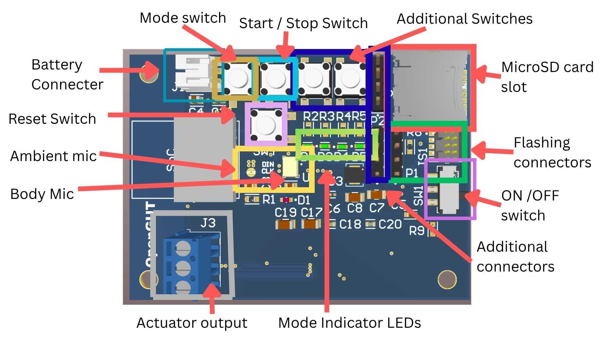
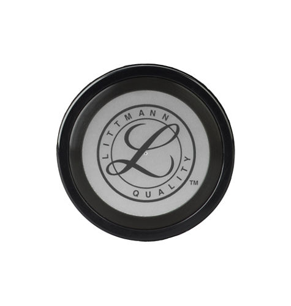
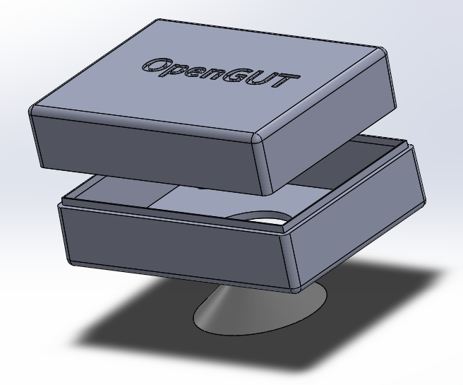

## PCB Design & Flashing Guide

  

The `Project_Output_OpenGUT.zip` file contains the Gerber files required for PCB manufacturing (e.g., via JLCPCB).

To modify the design, open the project file `OpenGUT.PrjPcb` in Altium Designer and make the necessary changes.

---

## Enclosure Design & Assembly Guide

### Overview
The enclosure consists of three 3D-printable components that house the electronics and provide a skin interface.

---

### Components

**Top Casing** – Protective upper shell  

  

**Bottom Casing** – Structural base for internal components  

  

**Conical Interface** – Skin-contact interface  

  

---

## Assembly Instructions

### 1. Diaphragm Attachment
Attach a standard Littmann diaphragm directly to the cone.  
[Example Littmann diaphragm][littmann]

  

---

### 2. PCB & Casing Integration
- Screw the PCB into the mounting points on the bottom casing  
- Secure the cone to the bottom casing using hot glue  

  

- Attach the top casing using the lip-and-groove mechanism  

---

### 3. Final Inspection
Ensure all components are securely fitted and properly aligned before use.

---

[littmann]: https://www.ebay.com/itm/366332360002
