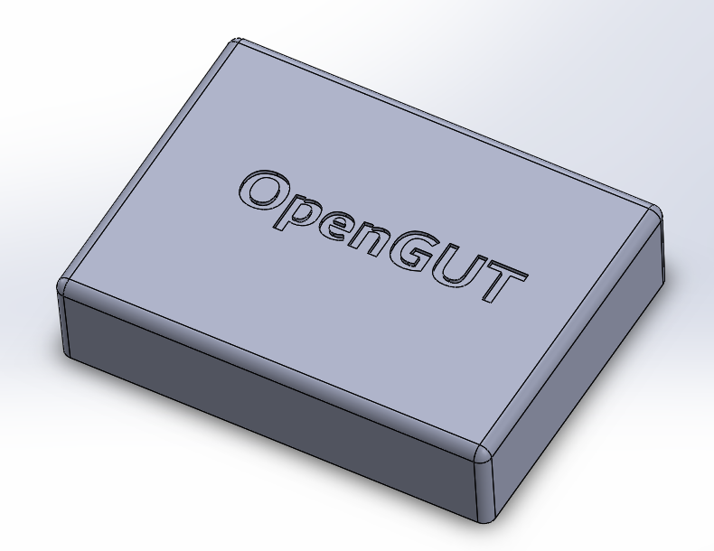
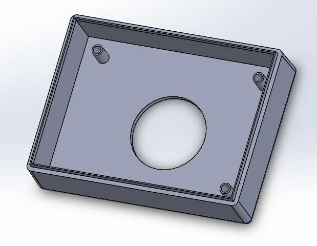
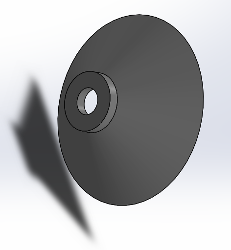

PCB Design & Flashing Guide

Project_Output_OpenGUT.zip has the Gerber file which can be used to manufacture through a PCB manufacturer like JLCPCB. 
If you want to make any changes to the PCB design, the project file (OpenGUT.PrjPcb) can be opened on Altium and the changes can be made.  

Enclosure Design & Assembly Guide

Overview
The enclosure design consists of three primary components designed for 3D printing. These parts house the internal electronics and provide the necessary interface for skin contact.
Main Components
Top Casing: Protective upper shell.

Bottom Casing: Main structural base for internal components.

Conical Interface: The part that interfaces with the skin.

Assembly Instructions
1. Diaphragm Attachment
Attach an off-the-shelf Littmann diaphragm directly to the cone component.

2. PCB and Casing Integration
Screw the PCB into the mounting points on the bottom casing.
Secure the cone to the bottom casing using hot glue.

Attach the top casing to the bottom casing using lip and groove. 

3. Final Inspection
Ensure all parts are flush and secure before final use.

